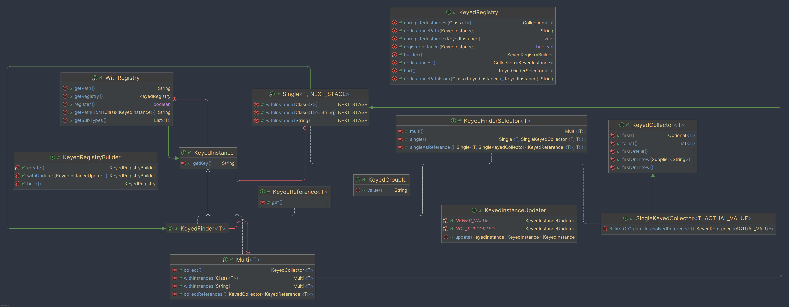

# Keyed Instances


## What's Keyed Instances?

Keyed Instances is a library that provides a flexible way to register and manage instances based on unique keys and group identifiers, as defined by `KeyedGroupId`.

## Features

* **Register Instances**: Easily register objects that implement the `KeyedInstance` interface.
* **Flexible Retrieval**: Retrieve objects using a full path (e.g., `currency.tokens`) or, if the parent class is known, by specifying only the parent and the key (e.g., `tokens`).
* **Keyed References**: Access keyed references, ideal for configurations that may be reloaded at runtime—allowing references to stay up-to-date with current objects.
* **Unresolved References**: Create "unresolved" references, useful for configurations that depend on other lazily resolved or yet-to-be-loaded objects.
* **Group Implementations**: Find all instances within a specific group.
* **Multiple Root Interfaces**: Each `KeyedInstance` can belong to multiple root groups, allowing retrieval via any associated path, such as `group_a.<instance_key>` or `group_b.<instance_key>`.

### Example Usage

```java
public static void main(String[] args) {
    // Create the registry
    final KeyedRegistry registry = KeyedRegistry.builder().build();

    final GroupABImpl instance = new GroupABImpl();

    // Register an instance
    registry.registerInstance(instance);

    // Retrieve by class
    registry.<GroupABImpl>find().single().withInstance(GroupABImpl.class).firstOrNull();

    // Retrieve by path
    registry.<GroupABImpl>find().single().withInstance("group_a.inner.impl").firstOrNull();

    // Get the full path of an instance (uses the first root if multiple exist)
    registry.getInstancePath(instance);

    // Get a reference to the instance
    registry.<GroupABImpl>find().singleAsReference().withInstance(GroupABImpl.class).firstOrNull();

    // Get an unresolved reference
    registry.<GroupABImpl>find().singleAsReference().withInstance("group_a.inner.not_existing_yet").firstOrCreateUnresolvedReference();

    // Get path from a parent group (returns path as 'inner.impl')
    registry.getInstancePathFrom(GroupA.class, instance);
}

@KeyedGroupId("group_a")
public interface GroupA extends KeyedInstance {}

@KeyedGroupId("group_b")
public interface GroupB extends KeyedInstance {}

@KeyedGroupId("inner")
public interface InnerGroup extends GroupA, GroupB {}

public static class GroupABImpl implements InnerGroup {
    @Override
    public @NonNull String getKey() {
        return "impl";
    }
}
```

## Structure
